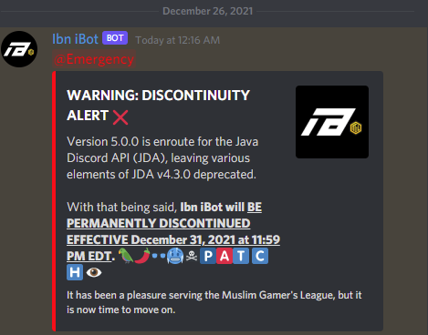

# Ibn iBot

UPDATED 2026-09-08

> Historical Project - Developed and operated during 2020-2021. **No longer maintained.**

Ibn iBot was a Java Discord automoderation bot I developed in high school for the **Muslim Gamers' League (MGL)**, a Discord community with more than 4,000 members at the time. I began building Ibn iBot shortly after taking AP Computer Science A. It became my first substantial independent software project and my first experience building, deploying, and operating software for real users.  

The bot was built using **Java and the Java Discord API (JDA)** and deployed as a JAR on a Raspberry Pi, where it could remain online 24/7 even when human moderators were unavailable.

## Core Technologies

- Java 8
- Java Discord API (JDA) v4.3.0
- Gradle
- Shadow Gradle Plugin
- Eclipse
- Raspberry Pi

## Project Timeline

- **October 2020** - Initial development of the project commenced.
- **2020-2021** - Developed and operated the bot for MGL.
- **May 2021** - I stepped off MGL but maintained the bot for the staff and community.
- **December 31, 2023** - Ibn iBot was formally discontinued.
- **May 2023** - Preserved source code uploaded to GitHub.
- **September 2026** - The repo was revitalized for public presentation, including writing this README and removal of a defunct Discord OAuth token.

## Features

### Automated Moderation

Ibn iBot included event listeners for:
- Filtering prohibited language
- Detecting and removing unauthorized links in messages
- Suppressing unwanted `@everyone` and `@here` pings
- Responding automatically to moderation events
- Preventing itself from catching in a message loop

Some filtering behavior was role- and channel-aware, allowing different permissions depending on the context of a message.

### Staff Moderation Tools

The bot provided commands for common moderation actions, including:
- Strikes
- Timed mutes
- Kicks
- Bans
- Bans with messages being purged
- Bulk message purging

Moderation commands included permission checks and generated Discord messages or embeds providing feedback about the action taken.

### Moderation Logging

Moderation actions could be recorded in a dedicated infractions channel, providing staff with a record of actions performed through the bot.

Depending on the action, Ibn iBot could also notify affected members through Discord DMs.

### Remote Kill Switch

Because Ibn iBot ran continuously on a Raspberry Pi, I implemented a simple remote shutdown mechanism.

Sending `i-->kill` to the bot through a private Discord DM caused it to verify that the sender matched the configured bot owner before shutting down its JDA process.

This allowed me to remotely stop the deployed bot from my phone without needing physical access to the Raspberry Pi.

## Deployment

Ibn iBot was packaged as a Java application and deployed as a JAR to a Raspberry Pi, allowing the bot to remain online continuously without requiring my personal computer to be running. Much of this development workflow I learned from tutorial videos, JDA 4 documentation, and expanding features of the project.

## A Note on Repository History

Ibn iBot was not originally developed using GitHub for version control. In May 2023, I uploaded my preserved copy of the source code to GitHub for safekeeping. As a result, **the Git commit history in this repository does not represent the project's original development history or timeline.** Other than revitalizing the repository for public presentation I chose not to rewrite it to preserve my original engineering work.

I left the Muslim Gamers' League community in May 2021, but Ibn iBot remained operational and maintained through the remainder of the year. It was formally discontinued on **December 31, 2021.** Ibn iBot was designed specifically for the Muslim Gamers' League and has long since served its original purpose. The original bot account and Raspberry Pi deployment are no longer active.

